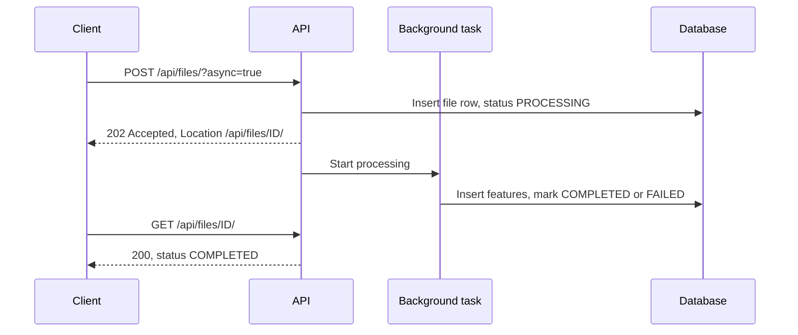
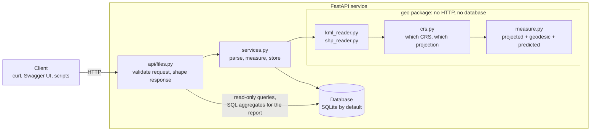
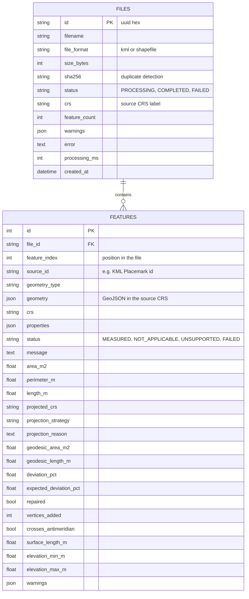
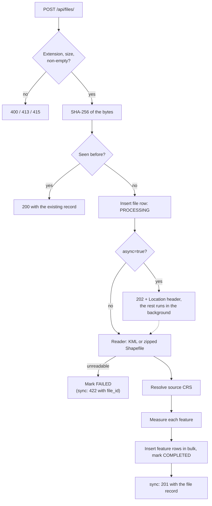
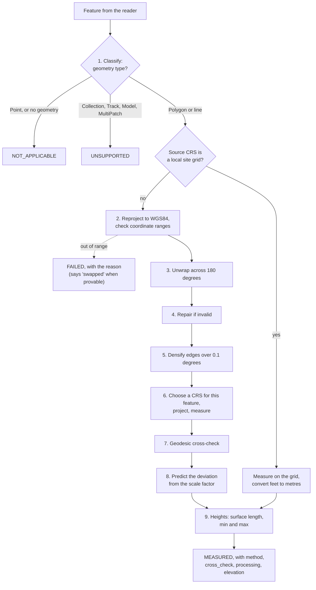
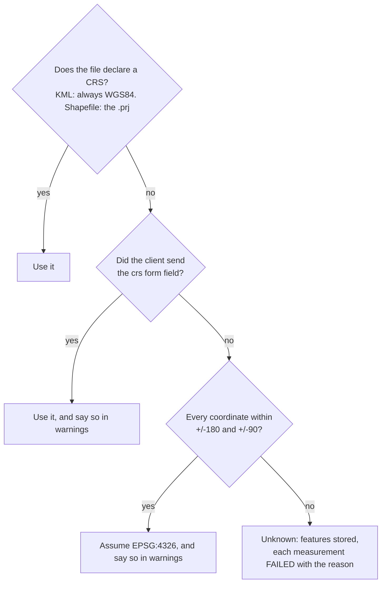
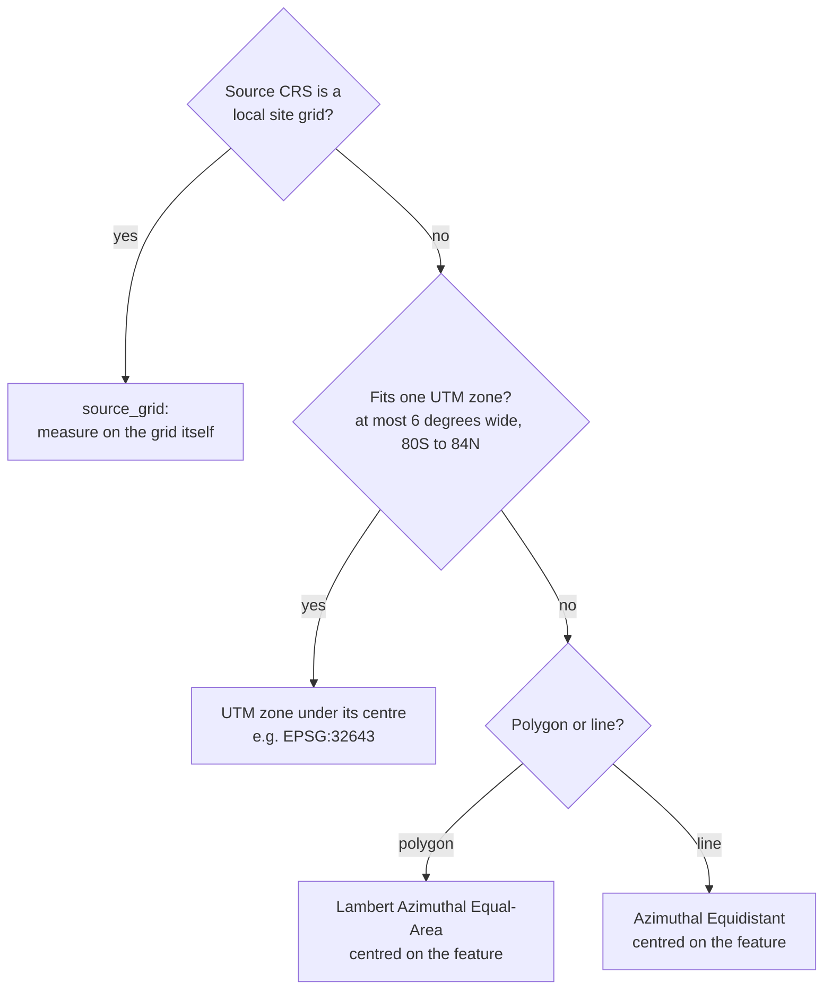

# Geospatial File Measurement API


A FastAPI service that accepts a **KML** file or a **zipped Shapefile**, extracts every feature, and returns the **area of each polygon** and the **length of each line** in metres. With every number it also returns the evidence that the number is right.

```json
{
  "area_m2": 5000.0,
  "method":      { "source_crs": "EPSG:32643", "projected_crs": "EPSG:32643", "strategy": "utm_zone",
                   "reason": "UTM zone 43N, which covers 72E to 78E and contains the centre of this feature." },
  "cross_check": { "method": "geodesic (WGS84 ellipsoid)", "area_m2": 4994.302,
                   "deviation_pct": 0.1141, "expected_pct": 0.1141, "unexplained_pct": 0.0 }
}
```

- `area_m2`: the planar area in a projected CRS chosen for this feature.
- `cross_check.area_m2`: the same area computed directly on the WGS84 ellipsoid, with no projection involved.
- `deviation_pct`: the observed gap between the two methods.
- `expected_pct`: the gap the projection is *predicted* to cause at this spot, from its scale factor. This third calculation uses neither of the first two results.
- `unexplained_pct`: what is left over. `0.0` means the two methods differ by exactly the projection's known distortion and by nothing else.

---

## Contents

1. [What makes this different](#what-makes-this-different)
2. [What you can expect from it](#what-you-can-expect-from-it)
3. [Requirements coverage](#requirements-coverage)
4. [Setup: run it locally](#setup-run-it-locally)
5. [Try it with the sample files](#try-it-with-the-sample-files)
6. [API](#api)
7. [Architecture](#architecture)
   - [System overview](#system-overview) · [Application structure](#application-structure) · [Data model](#data-model)
   - [File-processing flow](#file-processing-flow) · [Measurement calculation flow](#measurement-calculation-flow)
   - [CRS handling](#crs-handling) · [The antimeridian](#the-antimeridian) · [Heights (Z values)](#heights-z-values)
8. [Repository guide: what each file contains](#repository-guide-what-each-file-contains)
9. [Design decisions](#design-decisions)
10. [Testing](#testing)
11. [Known limitations](#known-limitations)
12. [Learnings](#learnings)
13. [Future scope](#future-scope)
14. [Other documentation](#other-documentation)
15. [Submission](#submission)
16. [License](#license)

---

## What makes this different

The brief asks for a service that measures polygons and lines after reprojecting them. Most solutions will do that correctly for clean files near the middle of a UTM zone. This one is built around a different question: **how does the caller know a number is right, and what happens when the file is not clean?**

| Concern | A typical solution | This project |
|---|---|---|
| Is the number right? | One value, taken on trust | Two independent methods (projected and geodesic), plus a third prediction from the projection's scale factor. The gap between the methods is shown and explained. |
| Which projection? | One CRS for the whole file, often a fixed one | Chosen **per feature** (its own UTM zone), with an equal-area or equidistant fallback for very large or polar features. Every choice comes with a one-sentence `reason`. |
| A whole file at a glance | Page through every feature | `GET /api/files/{id}/report/`: projections used, the worst deviation, repairs, and failures grouped by reason. 47 ms on a 20,000-feature file. |
| A feature across the 180th meridian (Fiji, the Aleutians) | Silently measured the long way round the globe: a 1.2 km² parcel became 42,469 km² | Measured as one continuous shape: 1.18 km², with the cross-check confirming it |
| Heights in the file | Ignored | Used when they are real elevations: a line gets its **length along the ground**, and every feature gets its elevation range |
| A drone or CAD **site grid** with no lat/lon link | Every feature fails | Measured directly on the grid, and the response says why there is no cross-check |
| Invalid polygon (a "bow-tie") | Crash, reject, or a silently wrong area | Repaired, measured, and flagged with the reason |
| One corrupt feature in 20,000 | The whole upload fails | That feature is `FAILED` with a message; the other 19,999 are measured |
| Latitude/longitude written the wrong way round | Rejected with a generic error, or silently wrong | Detected when provable, and the message says so |
| Large files | The client waits | `?async=true`: `202` at once, then poll the status |
| Hostile uploads | Not considered | XML entity attacks, zip bombs and zip-slip paths blocked; size limits |
| Evidence | A few tests | 165 tests: known-answer tests, mutation tests that feed in hundreds of corrupted files, and checks of 16 sample files against answers known in advance |

## What you can expect from it

- **Every measured number is in metres or square metres, with its method.** The CRS it was measured in, why that CRS was chosen, and how it compares with an independent geodesic calculation.
- **Survey-grade agreement on survey-scale features.** For plots, roads, pits, power lines and buildings, `unexplained_pct` stays at or below about 0.001% across every sample file: the projected and geodesic values differ only by what the projection is known to do. (It grows, and is reported, for features spanning a large part of a UTM zone; see [CRS handling](#crs-handling).)
- **No silent guessing.** A missing CRS is inferred only when the coordinates leave no doubt, and the response says so. Otherwise the features are stored and each measurement is `FAILED` with the reason: no number is better than a wrong one.
- **A bad file never crashes the server.** An unreadable file gets a `4xx` with a specific error code, never a `500`. Mutation testing with hundreds of corrupted files backs this up.
- **A bad feature never sinks the file.** Every feature gets a status (`MEASURED`, `NOT_APPLICABLE`, `UNSUPPORTED` or `FAILED`), and every non-measured one says why.
- **Idempotent uploads.** Uploading the same bytes again returns the earlier result (SHA-256 match) instead of reprocessing.
- **Throughput.** About 4,000 features per second end to end, including storage. The 20,000-building sample takes about 5 seconds.
- **Zero setup.** SQLite by default and pure-Python geospatial libraries, so `pip install` works on Windows, macOS and Linux with no GDAL. Or skip Python entirely: `docker compose up`.

## Requirements coverage

Every item in the brief, and where it is met.

| Brief section | Requirement | Where |
|---|---|---|
| 1. Backend framework | Django + DRF or FastAPI | FastAPI: `app/main.py`, `app/api/files.py` |
| 2. File upload | `POST /api/files/` accepting a `.zip` Shapefile or a `.kml` | `POST /api/files/` (also `.kmz`) |
| 3. File processing | Per feature: ID/index, geometry type, geometry, CRS, properties | `GET /api/files/{id}/features/` |
| 3. File processing | Unsupported geometry handled gracefully | Per-feature status, see [Measurement status](#measurement-status) |
| 4. Measurements | Polygon area, LineString length, nothing for points | `app/geo/measure.py` |
| 5. CRS handling | No measuring in degrees; transform to a projected CRS first | `app/geo/crs.py`, see [CRS handling](#crs-handling) |
| 6. API design | Upload, file information, measurements | `POST /api/files/`, `GET /api/files/{id}/`, `GET /api/files/{id}/measurements/` |
| 7. Documentation | Setup | [Setup](#setup-run-it-locally) |
| 7. Documentation | API with example requests and responses | [API](#api) |
| 7. Documentation | Architecture: structure, file-processing flow, measurement flow, CRS handling | [Architecture](#architecture) |
| 7. Documentation | Design decisions and alternatives considered | [Design decisions](#design-decisions) |
| 8. Submission | Public GitHub repository | [Submission](#submission) |
| 8. Submission | Learnings and future scope in the README | [Learnings](#learnings), [Future scope](#future-scope) |

---

## Setup: run it locally

**Requirements:** Python 3.10 or newer. Nothing else: no GDAL, no database server.

### 1. Get the code and install

macOS / Linux:

```bash
git clone https://github.com/<your-username>/geospatial-measurement-api.git
cd geospatial-measurement-api
python -m venv .venv
source .venv/bin/activate
pip install -r requirements-dev.txt
```

Windows (PowerShell):

```powershell
git clone https://github.com/<your-username>/geospatial-measurement-api.git
cd geospatial-measurement-api
python -m venv .venv
.venv\Scripts\Activate.ps1
pip install -r requirements-dev.txt
```

`requirements.txt` holds what the service needs to run; `requirements-dev.txt` adds pytest, httpx and ruff.

### 2. Start the server

```bash
uvicorn app.main:app --reload
```

| URL | What it is |
|---|---|
| http://localhost:8000/docs | Swagger UI: interactive documentation; upload a file straight from the page |
| http://localhost:8000/redoc | ReDoc: the same API reference, laid out for reading |
| http://localhost:8000/openapi.json | The OpenAPI 3 schema, for generating clients |
| http://localhost:8000/health | Liveness check: `{"status": "ok"}` |

The SQLite database is created at `data/geomeasure.db` on first start. If you pull a newer version of the code, delete that file so the tables are recreated with any new columns (tables are created with `create_all`, not migrations).

### 3. Upload something

```bash
curl -F "file=@samples/parcels_utm43n.zip" http://localhost:8000/api/files/
curl http://localhost:8000/api/files/<id>/measurements/
```

### 4. Run the tests and the linter

```bash
pytest            # 165 tests, about 10 seconds
ruff check .
```

### Docker (optional)

Docker is an alternative to steps 1 and 2: it needs no Python on your machine. Start Docker Desktop (or the Docker engine) first.

```bash
docker compose up -d --build      # build and start in the background
docker compose ps                 # wait for "healthy" (a few seconds)
docker compose logs -f            # follow the logs
docker compose down               # stop; uploaded files are kept
docker compose down -v            # stop and delete the stored data
```

Without Compose:

```bash
docker build -t geomeasure .
docker run -d -p 8000:8000 -v geomeasure-data:/data geomeasure
```

Then use http://localhost:8000/docs exactly as above.

| Property | Detail |
|---|---|
| Base image | `python:3.12-slim`; about 425 MB, most of it numpy and the PROJ data used for CRS transformations |
| Reproducible | Installs the exact versions in `requirements.lock`, against which all 165 tests pass, so a rebuild later gets the same libraries |
| Data | The SQLite file lives on the `geomeasure-data` volume, so uploads survive a restart or `docker compose down` |
| Security | Runs as an unprivileged `appuser`; only the `app/` folder is copied into the image |
| Health | A health check calls `/health` every 30 s; `docker compose ps` shows `healthy` |
| Tested | CI builds the image, starts it, uploads `samples/parcels_utm43n.zip` and checks the four areas on every push |

If port 8000 is already taken, change the left side of the mapping: `-p 8080:8000` (or `"8080:8000"` in `docker-compose.yml`) and open http://localhost:8080/docs.

### Configuration

All settings are optional. Set them as environment variables or in a `.env` file (copy `.env.example`).

| Variable | Default | Meaning |
|---|---|---|
| `GEO_DATABASE_URL` | `sqlite:///./data/geomeasure.db` | Any SQLAlchemy URL, e.g. PostgreSQL |
| `GEO_MAX_UPLOAD_BYTES` | 50 MB | Largest accepted upload |
| `GEO_MAX_UNCOMPRESSED_BYTES` | 500 MB | Largest total size a zip may expand to (zip-bomb guard) |
| `GEO_MAX_FEATURES` | 100000 | Most features accepted in one file |

### Regenerate the sample files

```bash
python scripts/make_samples.py
```

---

## Try it with the sample files

`samples/` holds sixteen files. The first four are walked through below. The other twelve are modelled on typical drone-survey deliverables and listed in [Survey-style samples](#survey-style-samples). `tests/test_samples.py` uploads all sixteen and checks each against answers known in advance.

**1. `parcels_utm43n.zip`**: four rectangles drawn in exact metres on the UTM 43N grid, so the right answers are obvious (100 m x 50 m must be 5,000 m²).

| Parcel | Size on the grid | `area_m2` returned |
|---|---|---|
| P-001 | 100 x 50 m | 5000.0 |
| P-002 | 200 x 150 m | 30000.0 |
| P-003 | 40 x 25 m | 1000.0 |
| P-004 | 500 x 200 m | 100000.0 |

**2. `quarry_site.kml`**: nine placemarks that between them produce every outcome the API has.

| # | Placemark | Geometry | Status | Result | Note |
|---|---|---|---|---|---|
| 0 | Pit boundary | Polygon with a hole | MEASURED | 156,420.1 m² | Hole subtracted |
| 1 | Stockpile A | Polygon | MEASURED | 9,176.6 m² | |
| 2 | Topsoil dumps | MultiPolygon | MEASURED | 8,636.6 m² | Sum of two parts |
| 3 | Draft extension | Polygon | MEASURED | 5,997.7 m² | Self-intersecting; repaired, with a warning |
| 4 | Haul road | LineString | MEASURED | 244.3 m | |
| 5 | GCP-1 | Point | NOT_APPLICABLE | | Points have no area or length |
| 6 | Weighbridge | GeometryCollection | UNSUPPORTED | | Mixed point + polygon |
| 7 | Site office | none | NOT_APPLICABLE | | Placemark without geometry |
| 8 | Fence line | LineString | FAILED | | Corrupt coordinate string |

The file as a whole is `COMPLETED`: features 5 to 8 did not stop features 0 to 4 from being measured.

**3. `roads_no_prj.zip`**: a Shapefile with the `.prj` deliberately removed. The coordinates fit longitude/latitude ranges, so EPSG:4326 is assumed and the response says so in `warnings`. Or state the CRS yourself:

```bash
curl -F "file=@samples/roads_no_prj.zip" -F "crs=EPSG:4326" http://localhost:8000/api/files/
```

**4. `edge_cases.kml`**: features that break a naive implementation. Uploaded here in the background:

```bash
curl -i -F "file=@samples/edge_cases.kml" "http://localhost:8000/api/files/?async=true"   # 202, Location: /api/files/<id>/
curl http://localhost:8000/api/files/<id>/measurements/
```

| # | Placemark | Result | Without the handling described in [Architecture](#architecture) |
|---|---|---|---|
| 0 | Fiji parcel, straddling 180 degrees | 1,181,762 m² (geodesic 1,179,721; `unexplained_pct` 0.0) | 42,468,664,968 m² |
| 1 | Ferry route across 180 degrees | 32,313 m | 61,910,670 m |
| 2 | Pit ramp, `altitudeMode` absolute | 244.3 m on the map; `elevation.surface_length_m` 250.2 m, from 872 m up to 926 m | Heights ignored |
| 3 | Fence, default `clampToGround` | 435.8 m; `elevation` null, because KML says these altitudes are to be ignored | |

### Survey-style samples

These are synthetic: the regions are real, but every feature, name and identifier is invented. Most shapes are drawn in exact metres on a projected grid, so the right answer is known before the API sees the file.

| File | Modelled on | What it exercises | Known answer, as returned |
|---|---|---|---|
| `mine_stockpiles_3d.zip` | Opencast coal mine, Jharkhand (Shapefile PolygonZ, UTM 45N) | Pit with an island hole, 24-sided stockpile toes, heights on every boundary | Pit 600 x 350 m minus 80 x 60 m = **205,200.0 m²**; stockpile r = 55 m: 12 r² sin 15° = **9,395.1 m²**; all 7 with `elevation` |
| `village_property_parcels.kml` | Rural property mapping of a village settlement, Karnataka | 48 house plots sharing boundaries, `ExtendedData` property IDs, folders, lanes, landmarks | Every plot exactly w x d (e.g. 12 x 18 = **216.0 m²**); settlement 113 x 164 = **18,532 m²**; lanes **113.0 m** |
| `highway_corridor.kml` | 4-lane highway survey, Kolar | A route crossing the UTM 43N/44N boundary at 78E; 60 m right of way; chainage points | Package A measured in **EPSG:32643**, Package B in **EPSG:32644**; right of way = **60 m x centre-line length** |
| `solar_farm_blocks.zip` | Solar park layout, Rajasthan (UTM 42N) | Many identical assets in one layer | Boundary **364,000.0 m²**; 20 PV blocks of **9,600.0 m²**; 12 inverters of **60.0 m²** |
| `transmission_line_3d.zip` | 400 kV line in hills near Shimla (PolyLineZ) | Surface length vs plan length, tower elevations 1,820 to 2,600 m | Section 1: plan **1,600.0 m**, along the ground **1,648.8 m** (= Σ √(span² + climb²)) |
| `construction_site_grid.zip` | Building site on a local site grid (`LOCAL_CS`) | A CRS with no lat/lon link, measured with `strategy: source_grid` | Tower A 42 x 28 = **1,176.0 m²**; L-shaped Tower B **1,200.0 m²**; parking minus ramp **2,052.0 m²** |
| `legacy_kalianpur_survey.zip` | Pre-GPS cadastral parcels near Mysuru | India's legacy Everest-ellipsoid grid, EPSG:24383 (Kalianpur 1975 / India zone IVa) | A 100 x 80 m grid parcel is **8,019.1 m²** on the ground: the grid's 0.99879 scale factor, fully explained (`unexplained_pct` 0.0) |
| `farm_fields_epsg_prj.zip` | Wheat and paddy fields, Punjab | A `.prj` containing only `EPSG:32643`; rectangles, parallelograms, trapezoids, a triangle; farmer-declared areas | Exact areas (e.g. parallelogram 200 x 150 = **30,000.0 m²**); three fields declared 5 to 8% off their measured area |
| `pacific_antimeridian.kml` | Fiji and Aleutian surveys | A block with a hole, a zone stored as two halves split at 180, a ferry route, a 700 km cable | All 4 measured as continuous shapes; the halves are rejoined, not flagged as repaired |
| `regional_large_features.kml` | Regional studies | A 7-degree-wide area, a 15.5-degree rail corridor, an Antarctic area, a block past its UTM zone's edge | Strategies `local_equal_area`, `local_equidistant`, `local_equal_area`, `utm_zone`; equal-area deviation **0.0%** |
| `city_buildings_20k.zip` | 20,000 building footprints, Bengaluru | Load test, background upload | Total **3,369,809.0 m²**, equal to the sum of the grid areas read straight from the file; about 5 s end to end |
| `messy_field_export.kml` | Export from a field app | No namespace, Kannada names, CDATA, lat/lon swapped, bow-tie, zero-area sliver, empty and hand-typed coordinates, GPS track, 3D model, mixed geometry | 3 measured, 4 failed with a specific reason each (e.g. *"almost certainly stored as latitude,longitude"*), 3 unsupported, 2 not applicable; the file still completes |

Two of these turned up problems that were then fixed. The two halves of the reef zone were reported as "repaired", because once rejoined they share an edge; they are now merged as part of the antimeridian step. And a hand-typed `77.4000, 13.3520`, with a space after the comma, used to fail with *"could not convert string to float"*; it now names the bad coordinate and says what is wrong with it.

---

## API

| Method | Path | Purpose |
|---|---|---|
| `POST` | `/api/files/` | Upload and process a file |
| `GET` | `/api/files/` | List uploaded files, newest first |
| `GET` | `/api/files/{id}/` | File information |
| `GET` | `/api/files/{id}/features/` | Features: geometry, CRS, properties |
| `GET` | `/api/files/{id}/measurements/` | Measurements for every feature |
| `GET` | `/api/files/{id}/report/` | Quality report for the whole file |
| `DELETE` | `/api/files/{id}/` | Delete a file and its features |
| `GET` | `/health` | Liveness check |

The list endpoints take `limit` and `offset` query parameters.

### `POST /api/files/`

Multipart form upload.

| Field | Required | Description |
|---|---|---|
| `file` | yes | `.kml`, or `.zip` containing one Shapefile (`.shp`, with `.shx`, `.dbf`, `.prj` alongside). `.kmz` is also accepted. |
| `crs` | no | Source CRS such as `EPSG:32643`, `32643`, a PROJ string or WKT. Used only when the file declares none. |

| Query parameter | Default | Description |
|---|---|---|
| `async` | `false` | `true` returns `202 Accepted` at once with `"status": "PROCESSING"` and a `Location` header, and processes the file in the background. Poll `GET /api/files/{id}/` until the status is `COMPLETED` or `FAILED`. |

```bash
curl -F "file=@samples/parcels_utm43n.zip" http://localhost:8000/api/files/
```

`201 Created`:

```json
{
  "id": "51491929e853487584228431947ae8ca",
  "filename": "parcels_utm43n.zip",
  "file_format": "shapefile",
  "size_bytes": 1104,
  "feature_count": 4,
  "crs": "EPSG:32643",
  "status": "COMPLETED",
  "warnings": [],
  "error": null,
  "processing_ms": 48,
  "created_at": "2026-10-07T09:17:03.302038Z",
  "duplicate": false
}
```

Uploading the same bytes again returns `200 OK` with the same `id` and `"duplicate": true`, with or without `async`.

**Background upload.** With `?async=true` the response comes back before the file is read:



A file whose content turns out to be unreadable still gets `202`, because nothing has been read yet. Its status then becomes `FAILED`, with the reason in `error`.

### `GET /api/files/{id}/`

Returns the same object as above, without `duplicate`. `status` is `PROCESSING`, `COMPLETED` or `FAILED`.

### `GET /api/files/{id}/features/`

```json
{
  "file_id": "51491929e853487584228431947ae8ca",
  "total": 4,
  "limit": 100,
  "offset": 0,
  "results": [
    {
      "index": 0,
      "source_id": null,
      "geometry_type": "Polygon",
      "crs": "EPSG:32643",
      "properties": { "PARCEL_ID": "P-001", "LAND_USE": "Residential", "SURVEYED": "2026-09-28" },
      "geometry": {
        "type": "Polygon",
        "coordinates": [[[780000.0, 1440000.0], [780000.0, 1440050.0], [780100.0, 1440050.0], [780100.0, 1440000.0], [780000.0, 1440000.0]]]
      }
    }
  ]
}
```

`index` is the feature's position in the file, starting at 0. `source_id` is the file's own identifier when it has one (a KML Placemark `id`). `geometry` is GeoJSON in the file's own CRS, which `crs` names; it includes Z values when the file has real heights.

### `GET /api/files/{id}/measurements/`

Optional filter: `?status=MEASURED|NOT_APPLICABLE|UNSUPPORTED|FAILED`.

```json
{
  "file_id": "51491929e853487584228431947ae8ca",
  "filename": "parcels_utm43n.zip",
  "crs": "EPSG:32643",
  "summary": {
    "measured": 4,
    "not_applicable": 0,
    "unsupported": 0,
    "failed": 0,
    "total_area_m2": 136000.0,
    "total_area_hectares": 13.6,
    "total_length_m": 0.0,
    "total_length_km": 0.0
  },
  "total": 4,
  "limit": 100,
  "offset": 0,
  "results": [
    {
      "index": 0,
      "source_id": null,
      "geometry_type": "Polygon",
      "properties": { "PARCEL_ID": "P-001", "LAND_USE": "Residential", "SURVEYED": "2026-09-28" },
      "status": "MEASURED",
      "message": null,
      "area_m2": 5000.0,
      "area_hectares": 0.5,
      "perimeter_m": 300.0,
      "length_m": null,
      "length_km": null,
      "method": {
        "source_crs": "EPSG:32643",
        "projected_crs": "EPSG:32643",
        "strategy": "utm_zone",
        "reason": "UTM zone 43N, which covers 72E to 78E and contains the centre of this feature."
      },
      "cross_check": {
        "method": "geodesic (WGS84 ellipsoid)",
        "area_m2": 4994.302,
        "length_m": null,
        "deviation_pct": 0.1141,
        "expected_pct": 0.1141,
        "unexplained_pct": 0.0
      },
      "processing": { "repaired": false, "vertices_added": 0, "crosses_antimeridian": false },
      "elevation": null,
      "warnings": []
    }
  ]
}
```

For a line with real heights (`samples/edge_cases.kml`, feature 2), `elevation` is filled in:

```json
"elevation": { "surface_length_m": 250.158, "surface_perimeter_m": null, "min_m": 872.0, "max_m": 926.0 }
```

`summary` always covers the whole file, whatever the paging or filter.

| Block | Field | Meaning |
|---|---|---|
| `method` | `strategy` | `utm_zone`, `local_equal_area`, `local_equidistant`, or `source_grid` for a local grid measured directly |
| `method` | `reason` | One sentence saying why this projection was chosen for this feature |
| `cross_check` | `deviation_pct` | Observed gap: `(projected - geodesic) / geodesic * 100` |
| `cross_check` | `expected_pct` | Predicted gap, from the projection's scale factor at the feature's centre; `null` for the equidistant fallback |
| `cross_check` | `unexplained_pct` | `deviation_pct - expected_pct` |
| `processing` | `repaired` | The polygon was invalid and was repaired before measuring |
| `processing` | `vertices_added` | Vertices added along edges longer than 0.1 degrees before projecting |
| `processing` | `crosses_antimeridian` | The feature spans the 180th meridian and its longitudes were unwrapped before measuring |
| `elevation` | `surface_length_m` | Lines: length along the ground, including climbs and descents between vertices |
| `elevation` | `surface_perimeter_m` | Polygons: the same, around the boundary |
| `elevation` | `min_m`, `max_m` | Lowest and highest vertex, in metres |

`method`, `cross_check` and `processing` are `null` for a feature that was not measured. `elevation` is `null` unless the file has real heights. For a `source_grid` feature the `cross_check` figures are `null`, because a grid with no link to the globe has no ellipsoid to compare with.

### `GET /api/files/{id}/report/`

The measurements endpoint answers "what is the area of feature 12?". This one answers "can I trust this file, and what went wrong in it?" without paging through every feature. Everything is aggregated by the database: 47 ms on the 20,000-feature sample.

For `samples/quarry_site.kml`:

```json
{
  "file_id": "50176e17410b4819876e16cdb93fae08",
  "filename": "quarry_site.kml",
  "status": "COMPLETED",
  "crs": "EPSG:4326",
  "error": null,
  "warnings": [],
  "processing_ms": 18,
  "summary": {
    "measured": 5, "not_applicable": 2, "unsupported": 1, "failed": 1,
    "total_area_m2": 180230.958, "total_area_hectares": 18.023096,
    "total_length_m": 244.29, "total_length_km": 0.24429
  },
  "projections": [
    { "projected_crs": "EPSG:32643", "strategy": "utm_zone", "features": 5 }
  ],
  "cross_check": {
    "features_checked": 5,
    "max_abs_deviation_pct": 0.0884,
    "max_abs_unexplained_pct": 0.0002,
    "largest_deviation_index": 3
  },
  "processing": { "repaired": 1, "densified": 0, "crosses_antimeridian": 0, "with_elevation": 0 },
  "problems": [
    {
      "status": "UNSUPPORTED",
      "message": "Geometry type 'GeometryCollection' is not supported for measurement.",
      "features": 1,
      "first_index": 6
    },
    {
      "status": "FAILED",
      "message": "Could not read <LineString> geometry: malformed coordinate '77.4035;13.3491' (expected lon,lat)",
      "features": 1,
      "first_index": 8
    }
  ]
}
```

- `projections` lists every projected CRS used and how many features it measured. A file covering two UTM zones shows two rows.
- `cross_check` gives the worst case in the file. Here the two methods never disagree by more than 0.0884%, and all but 0.0002% of that is the projection's known distortion.
- `problems` groups `FAILED` and `UNSUPPORTED` features by reason, most common first. If 400 features fail for the same reason they appear as one line with `"features": 400`, not 400 lines.

### `DELETE /api/files/{id}/`

Deletes the file and its features; `204 No Content`. Uploading the same bytes afterwards processes them afresh.

### Measurement status

| Status | Meaning | Examples |
|---|---|---|
| `MEASURED` | Area or length was calculated | Polygon, MultiPolygon, LineString, MultiLineString |
| `NOT_APPLICABLE` | Nothing to measure | Point, MultiPoint, a feature with no geometry |
| `UNSUPPORTED` | A geometry type this service does not measure | Mixed GeometryCollection, Shapefile MultiPatch, KML Track/Model |
| `FAILED` | Should be measurable but could not be | Corrupt coordinates, unknown CRS, impossible latitude, a polygon around a pole |

Every non-`MEASURED` feature carries a `message` saying why.

### Errors

All errors have one shape. `code` is stable and meant for programs; `message` is meant for people.

```json
{ "error": { "code": "invalid_zip", "message": "The file is not a valid zip archive.", "file_id": "61879ae7a3b4471aae8236c686b40d4b" } }
```

| HTTP | `code` | When |
|---|---|---|
| 400 | `empty_file`, `invalid_crs` | Empty upload; unrecognised `crs` value |
| 404 | `file_not_found` | Unknown id |
| 413 | `file_too_large` | Upload exceeds the size limit |
| 415 | `unsupported_file_type` | Extension is not `.kml`, `.zip` or `.kmz` |
| 422 | `invalid_zip`, `invalid_kml`, `unsafe_xml`, `missing_shp`, `multiple_layers`, `invalid_shapefile`, `archive_too_large`, `too_many_features`, `unreadable_file` | The file was received but its content could not be read |

A 422 from processing includes `file_id`: the upload is kept on record with status `FAILED` and the reason in `error`, so `GET /api/files/{id}/` can show what happened.

---

## Architecture

### System overview



Dependencies point one way: `api` → `services` → `geo`. The `geo` package imports neither FastAPI nor SQLAlchemy, so the measuring logic is tested directly as plain functions and could be reused from a worker or a CLI unchanged.

### Application structure

```
app/
  main.py            FastAPI app, startup, error handler, OpenAPI description
  config.py          Settings from environment variables
  db.py              SQLAlchemy engine and sessions
  models.py          Tables: files, features
  schemas.py         Response shapes (Pydantic): the public JSON contract
  services.py        Orchestrates one upload: register, parse, measure, store
  api/
    files.py         HTTP endpoints
    errors.py        Uniform error response
  geo/               Geospatial core. No HTTP, no database.
    __init__.py      Extension -> reader table, safety net around the readers
    types.py         RawFeature, ParsedFile, Measurement, GeoFileError
    kml_reader.py    KML -> features
    shp_reader.py    Zipped Shapefile -> features
    crs.py           CRS resolution, reprojection, projection choice, scale factors
    measure.py       The measurement engine
tests/               165 tests
samples/             16 sample files
scripts/             Sample generator (make_samples.py)
```

A full file-by-file description is in the [Repository guide](#repository-guide-what-each-file-contains).

### Data model

One row per upload, one row per feature. A feature has exactly one measurement, so the measurement lives on the feature row rather than in a separate table.



### File-processing flow



Both readers produce the same output, a list of `RawFeature` objects holding a shapely geometry and a properties dict. Everything after the reader is format-agnostic, so adding GeoJSON or GeoPackage means writing one reader and adding one line to the `READERS` table in `app/geo/__init__.py`.

- **KML** is parsed with `defusedxml`. Placemarks are found at any depth. Element names are matched with the namespace stripped, because real files use several KML namespaces or none. `Point`, `LineString`, `LinearRing`, `Polygon` (with holes) and `MultiGeometry` are built; `name`, `description` and `ExtendedData` become properties. Altitudes are kept only where `altitudeMode` is `absolute` (see [Heights](#heights-z-values)).
- **Shapefile** archives are read in memory with `zipfile` and `pyshp`. The `.shp` may sit in a sub-folder; macOS `__MACOSX` entries are ignored; sibling files are matched case-insensitively. `.dbf` rows become properties (dates converted to ISO strings), `.prj` gives the CRS, `.cpg` gives the text encoding. For Z types (PolygonZ, PolyLineZ, ...) the heights are put back onto the geometry, since pyshp's GeoJSON view of a shape is always 2D.

The background path uses FastAPI's `BackgroundTasks` with its own database session, because the request's session is closed by the time it runs. Both paths call the same `process_file()` in `app/services.py`.

### Measurement calculation flow



For each feature, in `app/geo/measure.py`:

1. **Classify.** Polygon types get an area, line types get a length, points get nothing, anything else is `UNSUPPORTED`.
2. **Normalise to WGS84.** Reproject from the source CRS to longitude/latitude and drop Z values (area and length are planimetric). Reject coordinates outside valid longitude/latitude ranges.
3. **Unwrap at the antimeridian.** A feature that crosses 180 degrees is made continuous (see [The antimeridian](#the-antimeridian)).
4. **Validate.** An invalid polygon is repaired with `shapely.make_valid` and a warning is attached that says what was wrong.
5. **Densify.** Edges longer than 0.1 degrees (about 11 km) get extra vertices. Reprojection only moves vertices, so without this a very long edge would be drawn straight in the target CRS and drift from the line it represents. Survey-scale features have no edges this long and pass through unchanged.
6. **Project and measure.** Choose a projected CRS for this feature, reproject, and take the planar `area` and `length`.
7. **Cross-check.** Compute the same quantity on the ellipsoid with `pyproj.Geod` and record the percentage difference.
8. **Predict.** Ask PROJ for the projection's scale factor at the feature's centre and convert it to the deviation it should cause. Store it next to the observed deviation.
9. **Heights.** If the file has real heights, compute the surface length and the elevation range from the original vertices (see [Heights](#heights-z-values)).

A feature in a local site grid skips steps 2, 3, 5, 7 and 8: it is measured directly on its grid. The function never raises; any failure becomes a `FAILED` result for that one feature.

### CRS handling

**Which CRS is the file in?** In order of trust:



1. What the file declares. KML is WGS84 by specification. A Shapefile's `.prj` is parsed with pyproj, and may be WKT (the usual form), an authority code such as `EPSG:32643`, or a PROJ string; some tools write the latter two.
2. What the client supplies in the `crs` form field, used only if the file declares nothing.
3. Inference, when a Shapefile has no `.prj`: if every coordinate fits within ±180 and ±90 the file is assumed to be EPSG:4326, and a warning says so.
4. Otherwise the CRS is unknown. Features are still extracted and stored, but each measurement is `FAILED` with the reason. No number is better than a wrong one.

**Why not measure in degrees?** A degree is an angle. One degree of longitude is about 111 km at the equator, 108 km at Bengaluru and 56 km at 60N. A test (`test_same_size_in_degrees_is_not_the_same_size_on_the_ground`) shows the same 0.01 x 0.01 degree box covering half the area at 60N that it covers at the equator.

**Which projected CRS?** Chosen per feature from its bounding box:



| Feature | Projection | Why |
|---|---|---|
| Fits in one UTM zone (up to 6 degrees wide, between 80S and 84N) | The UTM zone under its centre, e.g. `EPSG:32643` | Conformal, metre-based, the standard for survey deliverables, and identified by an EPSG code anyone can check in QGIS |
| Wider, or polar: polygons | Lambert Azimuthal Equal-Area centred on the feature | Preserves area by construction, at any size and latitude |
| Wider, or polar: lines | Azimuthal Equidistant centred on the feature | Low length distortion near its centre |
| The file is in a local site grid | That grid itself (`source_grid`) | See below |

The zone is `floor((lon + 180) / 6) + 1`, and the EPSG code is `32600 + zone` in the northern hemisphere or `32700 + zone` in the southern.

Every geometry goes through WGS84 first, even one that is already projected. That gives one code path for every input CRS, and it protects against projected CRSs that are poor for measuring. A file in Web Mercator (EPSG:3857) is technically "projected", but measuring in it directly overstates areas by about 6% at Bengaluru and 300% at 60N.

**Local site grids.** Drone surveys and CAD drawings are often delivered on a site grid: a flat X/Y system with an arbitrary origin and no link to latitude/longitude (an "engineering CRS", `LOCAL_CS` in a `.prj`). Such coordinates cannot be converted to WGS84, so the usual path would fail for every feature. But they are already a flat grid in a known unit, so planar geometry on them gives the area and length directly, after converting feet to metres if the grid is in feet. The response says `strategy: source_grid`, explains why in `reason`, and leaves the cross-check figures `null`: with no way to place the grid on the globe there is nothing independent to compare with, and inventing a value would be worse than saying so.

**Axis order.** Every transformer is created with `always_xy=True`. EPSG:4326 is officially latitude-first, and without that flag pyproj honours it and silently swaps coordinates.

**What `deviation_pct` tells you.** UTM is not distortion-free. Its scale factor is 0.9996 on the central meridian and rises towards the zone edges, so UTM grid areas differ from true ground areas by roughly -0.08% to +0.2%. The sample parcels sit 280 km east of zone 43's central meridian and show +0.11%. A test asserts that a square placed on the central meridian shows exactly `0.9996² - 1 = -0.08%`, which is good evidence that both calculation paths are right.

**What `expected_pct` adds.** The paragraph above says a deviation between -0.08% and +0.2% is normal for UTM. `expected_pct` replaces that range with the exact figure for one feature. Every projection has a *scale factor* at each point: the ratio of a distance on the map to the same distance on the ground. PROJ can report it (`Proj.get_factors`). For lengths the predicted deviation is `(k - 1) * 100`, and for areas it is `(areal scale - 1) * 100`, which for UTM is `(k² - 1) * 100`.

| Where (1 km square) | Scale factor `k` | `expected_pct` | `deviation_pct` observed |
|---|---|---|---|
| On zone 43's central meridian (75E) | 0.999600 | -0.0800 | -0.0800 |
| Bengaluru (77.59E) | 1.000581 | +0.1161 | +0.1161 |
| The zone's eastern edge (77.98E) | 1.000898 | +0.1796 | +0.1796 |
| Any size, equal-area fallback | areal scale 1 | 0.0000 | 0.0000 |

So `deviation_pct` on its own says "the two methods differ by 0.18%", which could be a bug. With `expected_pct` beside it the response says "they differ by 0.18%, and 0.18% is what UTM does at the edge of a zone".

The prediction is sampled at one point, the feature's centre. That is exact for a plot, a road or a quarry. For a feature that fills a large part of a zone the scale factor changes from one side to the other, one sample is no longer the average, and `unexplained_pct` grows (about 0.02 for a 3-degree block). It is reported as a number, not as a pass/fail verdict, for that reason. The equidistant fallback used for very long lines is not conformal, its scale depends on the direction of the line, and `expected_pct` is `null`.

### The antimeridian

Longitude jumps from +180 to -180 at the 180th meridian, which runs through Fiji, Russia's Chukotka and the Aleutians. An edge from 179.995 to -179.995 is about 1 km long on the ground, but its two longitudes are 359.99 apart as numbers. Every later step takes the numbers at face value. The bounding box spans the globe, so the projection falls back to one centred on longitude 0. Densifying then fills in the long way round, and the polygon is measured as a band around the Earth. The geodesic check uses the same densified vertices, so it agrees with the wrong answer: the cross-check cannot catch a mistake both methods share.

| `samples/edge_cases.kml` | Before | After |
|---|---|---|
| Fiji parcel, area | 42,468,664,968 m² | 1,181,762 m² (geodesic 1,179,721; `unexplained_pct` 0.0) |
| Ferry route, length | 61,910,670 m | 32,313 m |

The fix (`_unwrap_antimeridian` in `app/geo/measure.py`) follows the GeoJSON convention that an edge takes the shorter way round:

- Within each ring or line, every step longer than 180 degrees is taken the other way: -179.995 after 179.995 becomes 180.005. The new value is the original plus an exact multiple of 360, because `numpy.unwrap`'s running sum turned 179.9 into 179.89999999999995, enough to tip an edge over the densifying threshold.
- Holes and the parts of a multi-part feature are moved next to the first part. This also rejoins a feature already split into two halves at 180, which is how GeoJSON recommends storing one; halves that then share an edge are merged, not reported as a repair.
- The result is shifted so its centre lies in [-180, 180]. PROJ accepts the few longitudes left beyond 180, so the feature is measured in the UTM zone it actually lies in (zone 1 or 60) with the usual cross-check.
- A ring around a pole has no continuous unwrapped form: after unwrapping it no longer closes. It is reported as `FAILED` with that reason rather than measured.

### Heights (Z values)

Area and length stay planimetric: they are what a map, a cadastre or a CAD drawing reports. When a file carries real heights, the response adds an `elevation` block:

- `surface_length_m`: for a line, its length along the ground. Each step between two vertices combines the horizontal distance (geodesic, or grid distance on a local grid) with the change in height, so a ramp climbing out of a pit is longer than its map length. For a polygon the same is reported as `surface_perimeter_m`.
- `min_m`, `max_m`: the lowest and highest vertex.

Which heights count as real:

| Source | Used? | Why |
|---|---|---|
| Shapefile Z types (PolygonZ, PolyLineZ, PointZ, ...) | yes | Heights stored per vertex |
| KML with `altitudeMode` `absolute` | yes | Height above sea level |
| KML with no `altitudeMode` (`clampToGround`, the default) | no | The KML specification says altitude is ignored: the shape lies on the terrain |
| KML `relativeToGround` | no | Height above the terrain, which says nothing about how the ground rises or falls |
| Some vertices with a height and some without, or a non-finite height | no | Partial heights would give a meaningless figure |

Units: an explicit vertical axis wins (for example the compound CRS `EPSG:2229+6360`, whose heights are in US survey feet and come out as metres). Otherwise heights are taken to share the horizontal unit of a projected or local grid, and to be metres for longitude/latitude, which is what KML specifies.

No surface *area* is reported. The heights of a polygon's boundary say nothing about the ground inside it; that needs a terrain model (see [Future scope](#future-scope)).

---

## Repository guide: what each file contains

### Root

| File | Contains |
|---|---|
| `README.md` | This document |
| `LICENSE` | The MIT license |
| `pyproject.toml` | Project metadata, pytest settings (test path, Python path) and ruff lint rules |
| `requirements.txt` | Runtime dependencies: FastAPI, uvicorn, SQLAlchemy, pydantic-settings, shapely, numpy, pyproj, pyshp, defusedxml, python-multipart |
| `requirements-dev.txt` | Runtime dependencies plus pytest, httpx (for the test client) and ruff |
| `requirements.lock` | The exact, tested version of every package the Docker image installs, with the command to regenerate it |
| `Dockerfile` | Python 3.12 slim image; installs `requirements.lock`, runs as an unprivileged user, keeps SQLite on a `/data` volume, includes a health check |
| `docker-compose.yml` | One-command start: builds the image, maps port 8000, keeps data on a named volume |
| `.dockerignore` | Keeps everything but the app (tests, samples, virtual environment, caches, databases, docs) out of the build |
| `.env.example` | Every setting with its default, to copy to `.env` |
| `.gitignore` | Ignores virtual environments, caches, `.env`, `data/` and database files |
| `.github/workflows/ci.yml` | GitHub Actions, on every push and pull request: lint and the full test suite on Python 3.10 and 3.12, then a Docker job that builds the image, starts it, and checks a real upload |

### `app/`: the service

| File | Contains |
|---|---|
| `main.py` | Creates the FastAPI app, its OpenAPI description, startup (create tables), the error handler, `/` (redirects to `/docs`) and `/health` |
| `config.py` | `Settings`: database URL and size/feature limits, read from `GEO_`-prefixed environment variables or `.env` |
| `db.py` | SQLAlchemy engine and session factory; `get_db` (one session per request) and `get_session_factory` (for background work) |
| `models.py` | The `files` and `features` tables (see [Data model](#data-model)) |
| `schemas.py` | Pydantic response models: the public JSON contract, kept separate from the tables. Builds the nested `method`, `cross_check`, `processing` and `elevation` blocks |
| `services.py` | One upload end to end: `register_upload` (hash, duplicate check, PROCESSING row), `process_file` (parse, resolve CRS, measure, bulk insert, COMPLETED/FAILED), `process_in_background` |
| `api/files.py` | Every `/api/files/` endpoint: upload (sync and `?async=true`), list, info, features, measurements, report (SQL aggregates), delete; upload size limit |
| `api/errors.py` | `ApiError` and the handler that gives every error the same `{"error": {...}}` shape |

### `app/geo/`: the geospatial core (no HTTP, no database)

| File | Contains |
|---|---|
| `__init__.py` | The extension → reader table (`.kml`, `.zip`, `.kmz`) and the safety net that turns any unexpected parser exception into a clean `unreadable_file` error |
| `types.py` | Plain data types: `RawFeature`, `ParsedFile`, `Measurement`, `MeasurementStatus`, `GeoFileError` |
| `kml_reader.py` | KML parsing with `defusedxml`: placemarks at any depth, namespace-agnostic, holes, `MultiGeometry`, `ExtendedData`, `altitudeMode` |
| `shp_reader.py` | Zipped Shapefile reading in memory: zip-bomb and zip-slip protection, sibling matching, `.prj` (WKT, EPSG code or PROJ string), `.cpg` encodings, Z values, DBF type conversion |
| `crs.py` | Resolving a file's CRS, cached transformers (`always_xy=True`), reprojection, per-feature projection choice with its reason, scale-factor predictions, local-grid and unit helpers |
| `measure.py` | `measure_feature`: the full measurement pipeline, antimeridian unwrapping, polygon repair, geodesic cross-check, heights |

### `tests/`

| File | Contains |
|---|---|
| `conftest.py` | The `client` fixture: a test API client on a fresh, throwaway SQLite database per test |
| `helpers.py` | Builders for test input generated in memory: KML documents, zipped Shapefiles, UTM rectangles |
| `test_measure.py` | 60 tests of the measurement engine (see [Testing](#testing)) |
| `test_readers.py` | 52 tests of the KML and Shapefile readers and CRS resolution |
| `test_api.py` | 34 tests of every endpoint through HTTP |
| `test_samples.py` | 16 tests: every file in `samples/` against its known answers |
| `test_robustness.py` | 3 mutation tests: hundreds of deliberately corrupted files |

### `samples/` and `scripts/`

| File | Contains |
|---|---|
| `samples/*.kml`, `samples/*.zip` | 16 sample files, described in [Try it with the sample files](#try-it-with-the-sample-files) |
| `scripts/make_samples.py` | Regenerates the 14 generated samples (`quarry_site.kml` and `edge_cases.kml` are hand-written) |

---

## Design decisions

| Decision | Reasoning | Alternative considered |
|---|---|---|
| **FastAPI** | Typed request and response models generate the OpenAPI docs for free, and the brief is a small API with no admin UI, auth or templating to benefit from Django's batteries. | Django + DRF: more structure than this needs; I would pick it if users, permissions and an admin were in scope. |
| **pyshp + shapely + pyproj, and my own KML parser** | Pure-Python readers with no GDAL system dependency, so `pip install` works on any machine and the Docker image stays small. Writing the KML parser also meant I control exactly how malformed input is handled. | GeoPandas/Fiona: one line to read either format, but it brings GDAL, hides the parsing, and fails a whole file on one bad feature. |
| **Per-feature UTM zone, with an equal-area fallback** | A single file can span several zones; choosing per feature means each one is measured in the zone it actually lies in. The fallback means a country-sized polygon still gets a correct area. | One CRS per file: simpler but worse for wide datasets. Always a local custom projection: more accurate than UTM, but not an EPSG code a reviewer can verify. One global equal-area CRS such as EPSG:6933: correct areas but distorted lengths. |
| **Two methods, deviation reported** | A measurement API is only useful if the caller can trust it. The geodesic value is independent of any projection choice, so agreement is real evidence and disagreement is a visible warning. | Returning only the geodesic value: arguably the most accurate, but the brief asks for a projected calculation, and surveyors work in grid coordinates. |
| **A predicted deviation next to the observed one** | A bare deviation of 0.18% is ambiguous: it could be the projection or it could be a defect. The scale factor comes from a separate calculation, so when it matches the observed gap the gap is explained. | A fixed threshold ("under 0.5% is fine"): simpler, but it cannot tell a healthy 0.18% at a zone edge from an unhealthy 0.18% on a central meridian. A text verdict ("good agreement"): reads well, and hides the number a surveyor would want. |
| **A report endpoint aggregated in SQL** | Someone uploading 20,000 features wants to know whether anything went wrong before paging through results. Grouping and `max()` in the database keeps the response small and fast whatever the file size. | Computing it in Python from all rows: easier to write, and slow and memory-hungry on large files. Putting these figures in the measurements response: it would repeat them on every page. |
| **Per-feature status; the file fails only if it is unreadable** | Real survey exports are messy. Losing 500 good features because one has a broken ring is the wrong trade. | Rejecting the whole upload on the first bad feature: simpler, and hostile to users. |
| **Repair invalid polygons and warn** | A bow-tie polygon has an ambiguous area. Repairing gives a defensible number, and the warning tells the user to check the source. | Reject (loses data) or measure as-is (returns a silently wrong number). |
| **Never guess a CRS silently** | A wrong CRS produces plausible-looking wrong numbers, the worst kind of bug. Inference is used only when unambiguous and is always reported. | Defaulting to EPSG:4326 for everything. |
| **Synchronous by default, background on request (`?async=true`)** | A typical survey file finishes in well under a second, and one call returning one result is simplest for clients. A client sending large files, or one behind a proxy with a short timeout, can ask for `202` and poll the status column. Both paths run the same `process_file()`. `BackgroundTasks` needs no new infrastructure. | Celery/Arq with Redis: survives restarts and scales across machines, but needs a broker and a worker process for a reviewer to run. Async for every upload: makes the common small file take two calls. |
| **Unwrap features across the antimeridian, rather than split them** | Unwrapping keeps one feature as one shape, so it gets one projection, one cross-check and one predicted deviation, the same as everywhere else. | Splitting at 180 into two parts (what RFC 7946 recommends for *storing* GeoJSON): measurable, but each half would be judged separately and the response would describe two shapes for one feature. |
| **Heights only when they really are elevations** | A KML altitude under the default `clampToGround` is, by specification, to be ignored. Using it would turn a placeholder `0` or a nonsense value into a confident surface length. | Using any third coordinate present: more features with a figure, some of them wrong. |
| **Measure local site grids directly** | Their coordinates are already metres (or feet) on a flat plane, which is exactly what the projected path produces. Failing every feature would throw away a correct answer. | Rejecting them; asking the client for a georeference they often do not have. |
| **SQLite via SQLAlchemy; one `features` table** | Zero setup for whoever runs this. The database URL is configurable, so PostgreSQL works without code changes. A feature has exactly one measurement, so a separate measurements table would only add a join. | PostgreSQL + PostGIS: enables spatial queries and is what I would use in production, but it is infrastructure the reviewer would have to install. |
| **Geometry returned in the file's own CRS** | The brief asks for the feature's geometry and its CRS. Returning source coordinates next to the source CRS is consistent and lossless. | Converting everything to WGS84 GeoJSON: more standard, but then the stated CRS would not match the coordinates. |
| **Process in memory; never extract to disk** | No temp-file cleanup, and a malicious entry name like `../../etc/passwd` has nothing to act on. Size limits (upload, uncompressed total, feature count) bound memory use. | Extracting to a temp directory: needed for GDAL-based readers, and needs path sanitising. |
| **Duplicate detection by SHA-256** | Re-uploading the same survey is common. Hashing the bytes makes the upload idempotent: same content, same result, no recomputation. The lookup is skipped when a `crs` override is supplied, since that changes the outcome. | Always reprocess: simpler, and wasteful. |
| **One safety net around the readers** | The readers convert known failures into specific error codes. One broad `except` in `parse_upload` catches whatever else the third-party parsers throw at corrupt bytes and returns `unreadable_file` as a 422, with the traceback logged. | Listing every exception type: mutation testing showed the list is not knowable in advance (see [Testing](#testing)). |

---

## Testing

```bash
pytest                                  # everything: 165 tests, about 10 s
pytest tests/test_samples.py -v         # every sample file against its known answers
pytest -k antimeridian -v               # tests whose names match a word
ruff check .                            # lint
```

| File | Tests | What it covers |
|---|---|---|
| `test_measure.py` | 60 | Known-answer tests of the engine. A rectangle with 1,000 m sides on the UTM grid must measure 1,000,000 m²; a hole must be subtracted; a projected source must give the same answer as its longitude/latitude equivalent. Two tests document the traps this design avoids: degrees are not metres, and Web Mercator overstates area. The predicted deviation is tested against a figure that needs no code (UTM's defined 0.9996 on a central meridian), then against the observed deviation at five places across a zone and in both hemispheres. Antimeridian tests compare a shape across 180 with the same shape beside it; height tests use a 300 m ramp that climbs 400 m, and heights in US survey feet; local-grid tests use a rectangle that must be exactly 5,000 m². |
| `test_readers.py` | 52 | KML namespace variants, nested folders, `ExtendedData`, holes, `MultiGeometry`, malformed coordinates, an entity-expansion attack, every `altitudeMode`; Shapefiles with and without `.prj`/`.dbf`/`.shx`, a `.prj` written as an EPSG code or PROJ string, a local-grid `.prj`, PolygonZ heights including a hole, nested folders, upper-case extensions, null shapes, corrupt content, a zip bomb. |
| `test_api.py` | 34 | Every endpoint through HTTP: every error code, duplicates, paging, filtering, deletion, background uploads (success, an unreadable file, a duplicate, a bad `crs`) and the file report (grouped failures, two UTM zones, an unreadable file, antimeridian and height counts). |
| `test_samples.py` | 16 | Every file in `samples/` against answers known in advance: exact grid areas, w x d per plot, √(span² + climb²) per power-line span, the sum of the building footprints read straight from the file, the expected status and message for each feature of the messy export. |
| `test_robustness.py` | 3 | Mutation tests. Valid files are damaged at random (bytes flipped, truncated, repeated, zeroed; 300 rounds per file, fixed seed); the only allowed outcomes are a parsed file or a clean `GeoFileError`. |

The mutation tests earned their place. The first run produced server errors from five failure modes I had not anticipated, including a `KeyError` from pyshp on an impossible shape-type number, `ValueError: embedded null character` from a garbled `.cpg` encoding name, and `NotImplementedError` from `zipfile` on an unsupported zip version. All are now handled.

I also checked the sample results against a by-hand calculation using only Python's `math` module (a flat-earth approximation with the shoelace formula for areas, haversine for lengths). The two agree to within 0.3%, which is the expected gap between a sphere and the ellipsoid at this latitude.

CI (`.github/workflows/ci.yml`) runs on every push and pull request: the linter and the full test suite on Python 3.10 and 3.12, then a Docker job that builds the image, starts it, waits for `/health`, uploads a sample and checks the areas it returns. The test suite has also been run inside the Docker image itself, against the exact versions in `requirements.lock`.

---

## Known limitations

- **Area is planimetric (2D).** Lines get a surface length from their heights, but a polygon gets no surface area, because boundary heights say nothing about the ground inside. That needs a terrain model.
- **Polygons that encircle a pole** are reported as `FAILED`. Across the antimeridian, every edge is assumed to take the shorter way round (the GeoJSON convention), so a single edge meant to span more than 180 degrees of longitude would be misread; real survey data has no such edges.
- **Background jobs live in the server process.** If the server stops mid-file, that file stays `PROCESSING`. A durable queue would fix this (see [Future scope](#future-scope)). Background uploads are also held in memory, so the 50 MB limit applies to both modes.
- **Swapped coordinates are only caught when impossible.** A latitude of 113 is rejected, and the message says outright that the pair is swapped when swapping would make it valid. `13, 77` written where `77, 13` was meant is a valid location elsewhere and cannot be detected.
- **`expected_pct` is a single-point prediction.** It is exact for survey-scale features and approximate for features spanning a large part of a UTM zone (see [CRS handling](#crs-handling)).
- **Heights are assumed to be in the horizontal unit** (metres for longitude/latitude) unless the CRS has an explicit vertical axis. A Shapefile in a metre grid with heights in feet would need a compound CRS to be read correctly.
- **UTM zone exceptions** for Norway and Svalbard are not applied; those areas use the regular 6-degree grid, which has no meaningful effect on the result.
- **One Shapefile per zip.** An archive with several layers is rejected with a clear message.
- **Tables are created with `create_all`**, not migrations. A database file created by an older version of the code has to be deleted (`data/geomeasure.db`) so the new columns exist.
- **Duplicate detection is by content only**, so a renamed copy of an already-processed file returns the original record with the original filename.

---

## Learnings

- **"Projected" does not mean "accurate".** I started out assuming that reprojecting to UTM gave the true answer. Adding the geodesic cross-check showed a steady 0.1% gap, which led me to UTM's 0.9996 scale factor and the difference between grid distance and ground distance.
- **Reprojection moves vertices, not edges.** My first equal-area fallback was 0.9% off for a large polygon even though the projection is exactly area-preserving. The cause was long edges being straightened in the target CRS. Densifying long edges brought the two methods to within 0.0001%.
- **Axis order is a real trap.** EPSG:4326 is officially latitude-first, while KML, GeoJSON and Shapefiles are longitude-first. `always_xy=True` is the single most important flag in the codebase.
- **A Shapefile is several files, and each can be missing or wrong.** Handling an absent `.prj`, `.dbf` or `.shx` separately taught me more about the format than reading it did.
- **I cannot predict how a parser fails.** I wrote specific exception handlers, felt done, and then mutation testing found five more failure modes within seconds. Testing with generated bad input is now something I would do for any file-upload endpoint.
- **Profile before optimising.** A 20,000-feature file was slow, and I assumed the maths was the cost. Profiling showed a third of the time went on hashing pyproj CRS objects for a cache lookup. Keying the cache on the CRS definition text, converting all of a geometry's vertices in one call, and inserting rows in bulk halved the processing time.
- **A cross-check only catches errors the two methods do not share.** A parcel across the 180th meridian came out at 42,000 km² from both methods, in perfect agreement, because both worked from the same wrapped-around vertices. Agreement shows the arithmetic is consistent, not that the input was read correctly.
- **Realistic sample files find real bugs.** Writing samples modelled on actual survey deliverables, each with an answer known in advance, turned up two problems the unit tests had missed: halves of a feature split at 180 being reported as "repaired", and an unhelpful error for a hand-typed coordinate.
- **Keeping the geospatial code free of web and database imports** made it easy to test with plain function calls, and it made the code easier to reason about.

---

## Future scope

- **Volume and surface area from a terrain model.** Accept a DEM (GeoTIFF) alongside a polygon and return cut/fill volume for stockpiles and pits, and true surface area.
- **A durable job queue** behind the existing `?async=true` (Celery or Arq with Redis), with uploads streamed to object storage, so jobs survive restarts, run on separate machines, and are no longer bound by memory.
- **PostgreSQL + PostGIS** with real geometry columns and spatial indexes, to enable queries such as "features intersecting this boundary", plus Alembic migrations.
- **More formats**: GeoJSON, GeoPackage, DXF. Each is one new reader.
- **Grade along a line**: the steepest slope between vertices, which matters for haul roads, from the heights already read.
- **Selectable units and projection strategy** per request (acres, feet; a named EPSG code; equal-area on demand).
- **Georeferencing a local grid** from control points, so a `source_grid` file can also get the geodesic cross-check.
- **A `/features.geojson` export** in WGS84 with measurements attached as properties, to drop straight onto a map.
- **Authentication and per-user file ownership**, rate limiting, and structured request logging.

---

## Other documentation

| Where | What |
|---|---|
| `/docs` (Swagger UI) and `/redoc` | Interactive and printable API reference generated from the code: every endpoint, parameter, field description and response model |
| `/openapi.json` | The OpenAPI 3 schema, for generating client libraries |
| Module and function docstrings | Each module in `app/` opens with what it is responsible for and why; the non-obvious choices (axis order, densifying, antimeridian, heights) are explained where they are made |
| `scripts/make_samples.py` | Each sample generator's docstring states the shapes it draws and the answers they must produce |
| `tests/` | Test names read as statements of behaviour (e.g. `test_square_across_the_antimeridian_measures_like_the_same_square_beside_it`) |
| `.github/workflows/ci.yml` | What CI checks on every push |

---

## Submission

- **Repository:** https://github.com/&lt;your-username&gt;/geospatial-measurement-api
- **Brief coverage:** every requirement is mapped in [Requirements coverage](#requirements-coverage).
- **Learnings and future scope:** [Learnings](#learnings), [Future scope](#future-scope).

---

## License

Released under the [MIT License](LICENSE).
